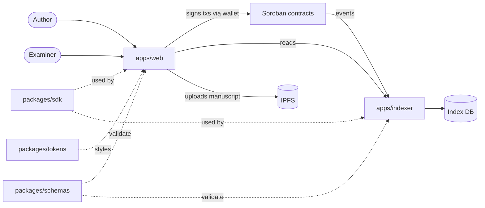

# Architecture

## Principles

- **Chain holds what must be trustless:** claim anchors, escrowed funds, stake, reputation, vote tallies.
- **Off-chain holds what is large or private:** manuscripts and datasets (IPFS), review text, search indexes.
- **The indexer is replaceable.** Anyone can rebuild it from contract events. It must never be a source of truth.
- **Contracts are small and separate** by responsibility so each can be audited on its own.

## Contracts

| Contract | Holds | Calls |
|---|---|---|
| `claim-registry` | claim hash, CID, author, timestamp | none |
| `inquiry-escrow` | bounty funds per claim | Stellar Asset Contract |
| `staking` | examiner stake and locks | Stellar Asset Contract |
| `reputation` | field-scoped non-transferable score | none |
| `cross-exam` | review quality votes | `reputation` |

The settlement authority is configured independently in each contract; testnet authority choices and remaining wiring decisions are recorded in `docs/adr/0004-contract-authority-and-settlement.md`.

## Data flow: registering a claim

1. Web computes SHA-256 of the manuscript and uploads it to IPFS, receiving a CID.
2. Web validates metadata against `packages/schemas/claim.schema.json`.
3. Author signs `claim-registry.register_claim(author, hash, cid)`.
4. Indexer sees the event and exposes the claim via `GET /claims`.
